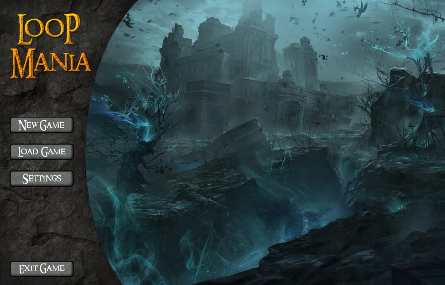
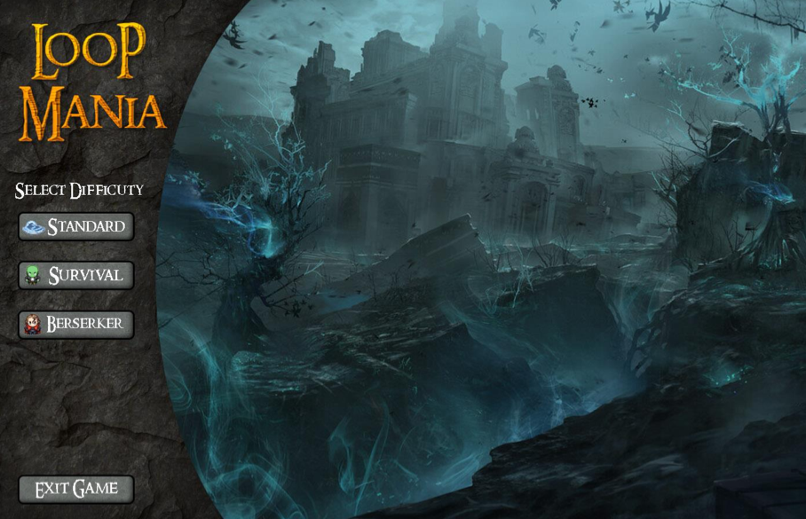
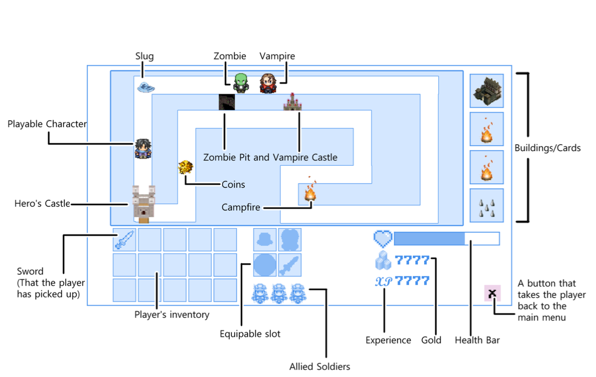
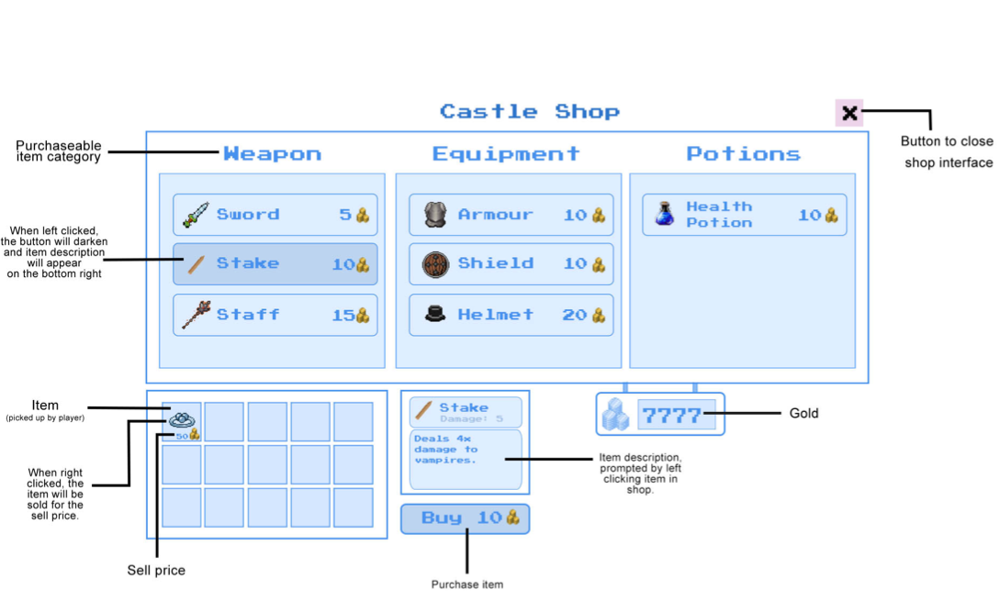
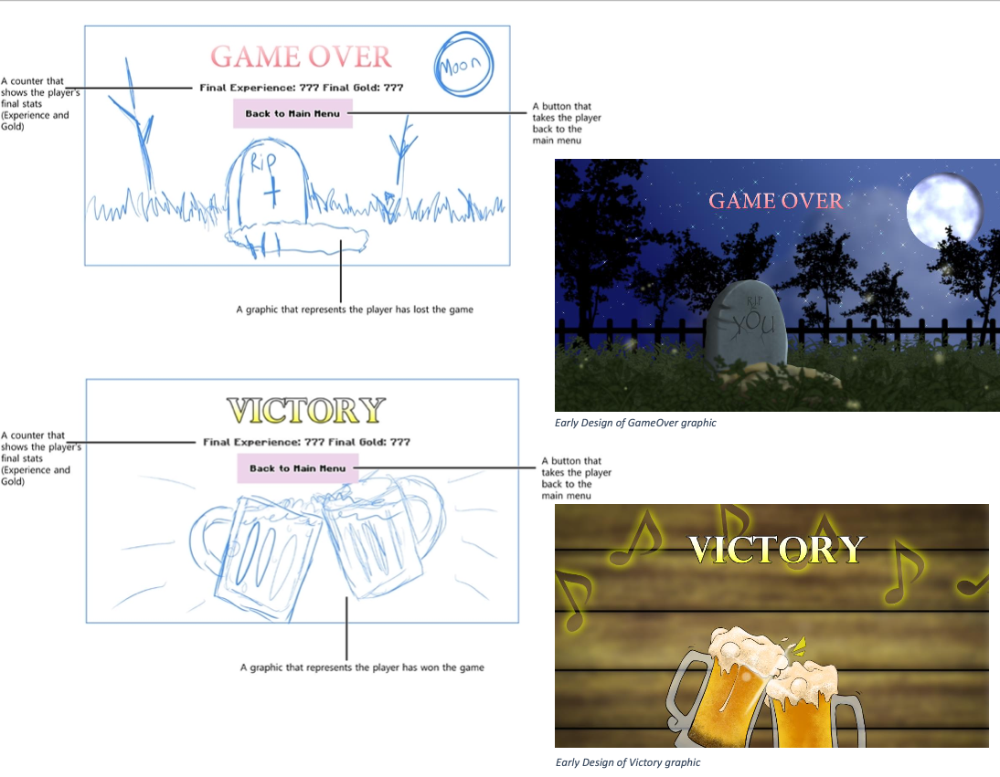
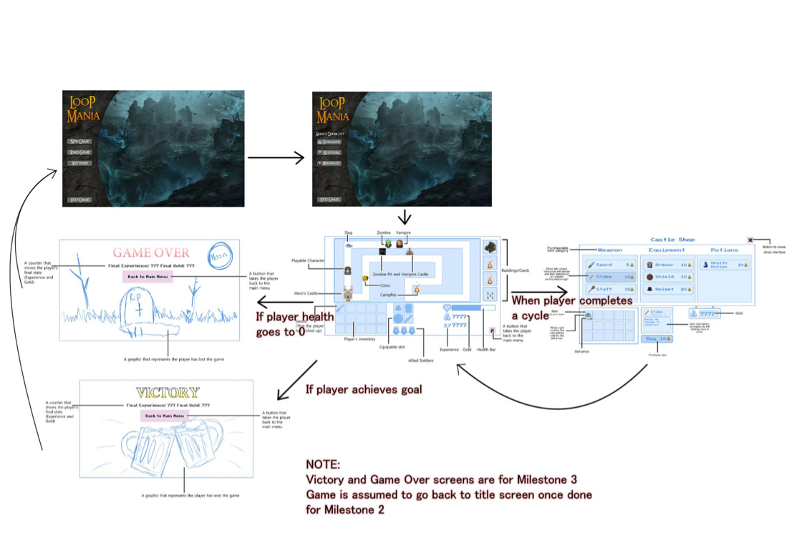
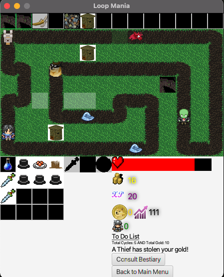
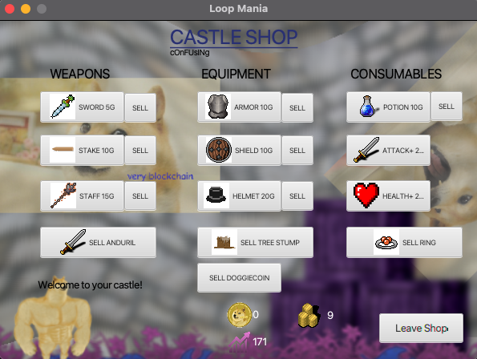
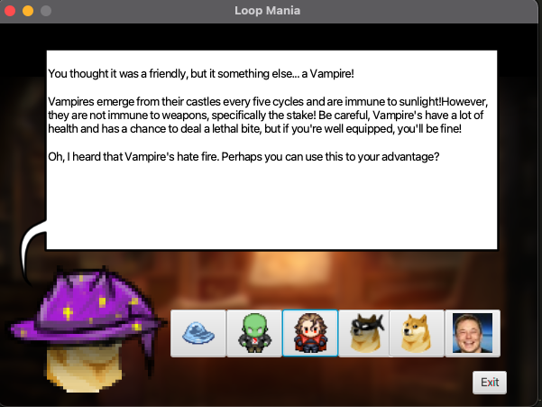

# LoopMania - COMP2511 project  

### Notice: 
- This repository is for demonstration purposes only 
- The details of the codes would not be shared 🔐    

### 📝 &nbsp; Project description: 
- An MVC based game application that was developed in Java, which requires players to follow a pre-generated path and fight with enemies 😈 along the path automatically.   

------------------------------------------------------------------------------------------------

###  📌  &nbsp; The game menu wireframe: 

------------------------------------------------------------------------------------------------

###  👾 &nbsp; The gameplay wireframe: 

------------------------------------------------------------------------------------------------

### 🎮 &nbsp; The actual gameplay screenshot: 

